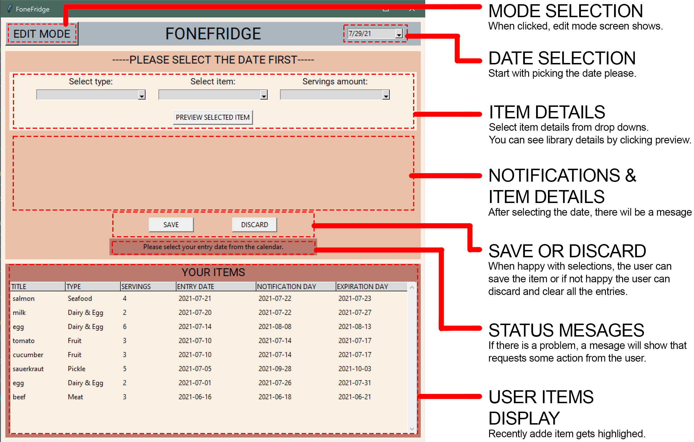
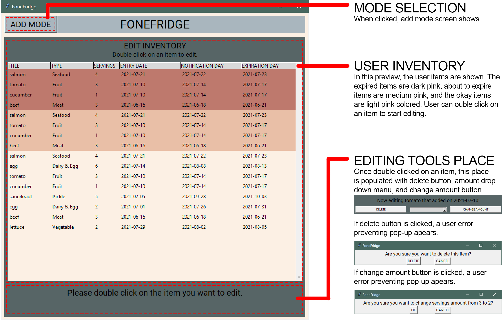

# FoneFridge
## Food items tracking app project 
HCI 584 summer 2021 - Pınar Adanır

-------
## INTRODUCTION

Food waste has been a huge issue for climate change, and there are some things we can do about it individually. Many people (as far as my questionnaire in the fall 2020 semester showed) struggle to keep track of their food stock when they are busy and they have little time to cook for themselves. As a result, many people throw away food items that they bought with the hope to cook them throughout the week but end up rotting in the deep corners of their fridges. For this problem, this product notifies people before the expiration date of the food items so that they can plan their meals accordingly. 

This desktop app helps people keep track of the food items in their fridge. It gives them notification message when the food item is about to expire and which ones are already expired. The user can search items from the app’s library of popular items. The items are classified based on their type (dairy, vegetable, meat, herbs, etc.). The popular items data is the `popular_items_library.csv` file that has generic food items such as tomatoes, eggs, and beef. This data also include a lifespan for each item in days and a generic notification time (like two days before expiration for some items).

---------------

## USER TASKS:

1. The user puts the new food items in the fridge.
2. Then enters the items in FoneFridge desktop application, by running `add_mode_run.py` file. (`edit_mode_run.py` file is the edit mode screen.)
4. In the add mode, user first selects the date from the calendar widget so that they are presented with the notification that shows expired and about to expire items before entering anything.
5. User searches for the item type.
6. After selecting a type, the item name dropdown shows the items from that type and user can select an item name.
7. user selects the serving count of their item from the servings dropdown menu.
8. Once user enters an amount, the entry is saved to the `user_items.csv` file when clicked on the “SAVE” button. 
9. If the user is not happy with the item, they can change the dropdown selections or click the “DISCARD” button to empty all of the selections.
10. There are status messages right under save and discard buttons so if there is a problem with saving item, the user is informed.
11. The user can see their items at the bottom of the window in add mode.
12. If wants to delete or change the servings amount, the user can go to the edit mode and double click on the item.
13. Once double clicked, the bottom part of the window gets populated by delete button and amount changing dropdown.
14. The user gets pop ups when they want to delete or edit to prevent user error.

-------
## REQUIREMENTS

**Please get the required modules to run this app.**

`pip install -r requirements.txt`

*If Tk version is not 8.6.10 or higher, there will be problems with the user items display widgets' visual designs.*

---------

## FILES

**RUNNING**

* After installing the required modules, please decide what you want to do; add a new item or edit your items. 
* To add a new item, you need to go to add mode. Please run `add_mode_run.py` file. 
* To edit your items, you need to go to edit mode. Please either run `edit_mode_run.py` file or click to the "EDIT" button in `add_mode_run.py` file.

**DATA STORING**

* In add mode when new item is created and saved, the item is stored in `user_items.csv` file.
* In edit mode, the program reads the `user_items.csv` file to display and enables the user to delete or change the amount of the item.

**LIBRARY**

* In `popular_items_library.csv` file, there are some of the popular food items with their, their types, their expiration spans, and their notification spans are stored.

-----------

## USAGE

`add_mode_run.py`: Runs the ADD MODE
`edit_mode_run.py`: Runs the EDIT MODE

Even though the modes are accessible inside both files, the user can choose where to start their experience with the FoneFridge app. 

----------

## TUTORIAL

**ADD MODE:**

**EDIT MODE:**

-----------

## THANKS FOR USING FONEFRIDGE!
